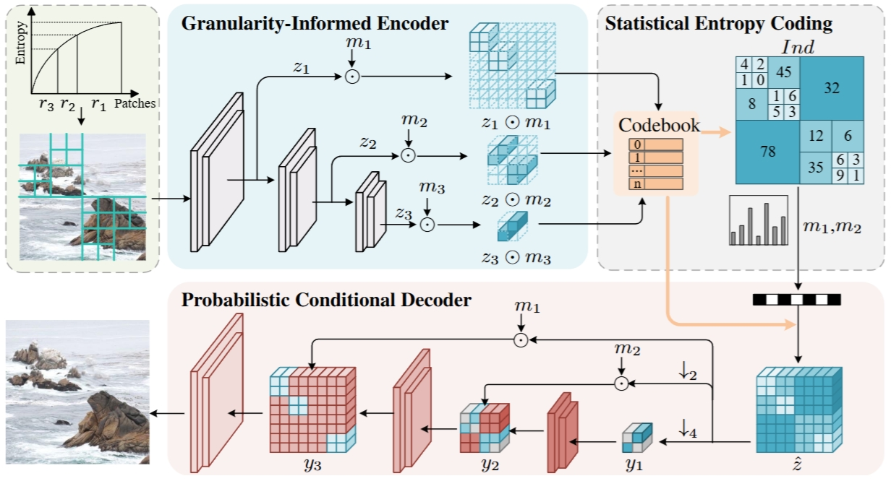

# Control-GIC: Controllable Generative Image Compression (ICLR 2025)


[**Once-for-All: Controllable Generative Image Compression with Dynamic Granularity Adaption**](https://arxiv.org/pdf/2406.00758) 

We design a unified generative compression model (Control-GIC) capable of variable bitrate adaption across a broad spectrum while preserving high-perceptual fidelity reconstruction. Control-GIC allows one model for variable bitrates and once compression on an entire dataset for constrained bitrate conditions.


<!--  -->

### News
<!-- #### 2024 -->
- The paper received an update: See https://arxiv.org/pdf/2406.00758.
- Update the pre-trained model with the codebook size of 1024.
- Improve the code, please update your local code.

## 🔓 Installation
```
git clone https://github.com/lianqi1008/Control-GIC.git
cd Control-GIC
conda create -n CGIC python=3.10.4
conda activate CGIC
pip install -r requirements.txt
```
## 🚀 Usage
The **model weight** can be downloaded from [GoogleDrive](https://drive.google.com/file/d/1kOWv7rrTYf0J_FtRXCrVEWRRSHU5JSfc/view?usp=drive_link) and [BaiduNetDisk](https://pan.baidu.com/s/1j0UGcE2LPjzvWeO6Nl3RWw?pwd=skib).

**Train**

We use [OpenImages-v6](https://storage.googleapis.com/openimages/web/download.html) dataset and randomly crop images to a uniform 256 × 256 resolution.
```
python main.py --config configs/config_train.yaml
```
**Inference**

We use [Kodak](https://r0k.us/graphics/kodak/), high-resolution [DIV2K](https://data.vision.ee.ethz.ch/cvl/DIV2K/) and CLIC2020 datasets to evaluate the model.

```
python inference.py -i input_dir -o output_dir
```
## 💡 Special Capabilities
**Fine control of bitrate**

By fine-tuning the granularity ratio, the model is able to make fine adjustments to the bitrate (Evaluated on the Kodak dataset).

| Granularity Ratio   | Bpp     | LPIPS   |
|:--------------------|:--------|:--------|
| (0.301, 0.599, 0.1) | 0.38925 | 0.03027 | 
| (0.302, 0.598, 0.1) | 0.38983 | 0.03025 |
| (0.303, 0.597, 0.1) | 0.39050 | 0.03020 |
| (0.304, 0.596, 0.1) | 0.39108 | 0.03014 |

**Constant bitrate**

Once the granularity ratio is fixed, the bpp values of each image in the dataset are very close to each other, thus easily fulfilling the constrained bandwidth and bitrate conditions. For example, in one compression on the Kodak dataset, we set the ratio to (0.1, 0.8, 0.1), and obtained 24 images with bpp ranging from **0.262** to **0.277**, with only slight variations. 

## Cite
```
@misc{li2024onceforall,
      title={Once-for-All: Controllable Generative Image Compression with Dynamic Granularity Adaption}, 
      author={Anqi Li and Feng Li and Yuxi Liu and Runmin Cong and Yao Zhao and Huihui Bai},
      year={2024},
      eprint={2406.00758},
      archivePrefix={arXiv}
}
```

## Thanks
The code references [VQGAN](https://github.com/CompVis/taming-transformers), [MoVQGAN](https://github.com/ai-forever/MoVQGAN), [DQ-VAE](https://github.com/CrossmodalGroup/DynamicVectorQuantization) and Huffman coding from Bhrigu Srivastava@bhrigu123. Thanks for these excellent works!
